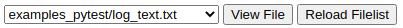
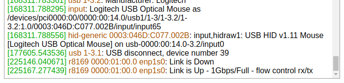
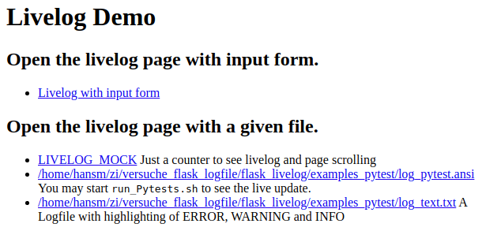
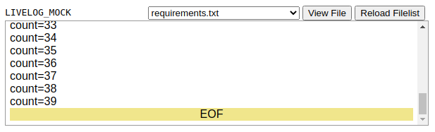
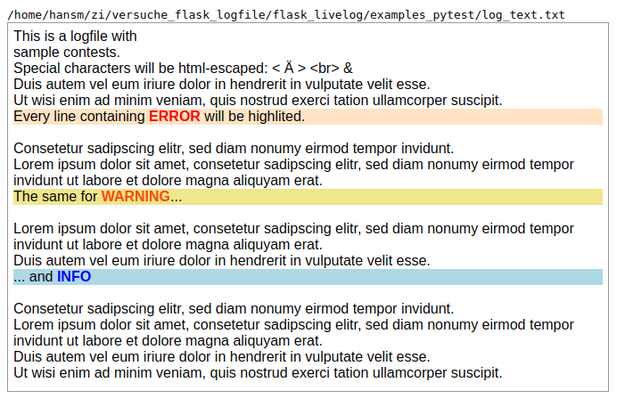
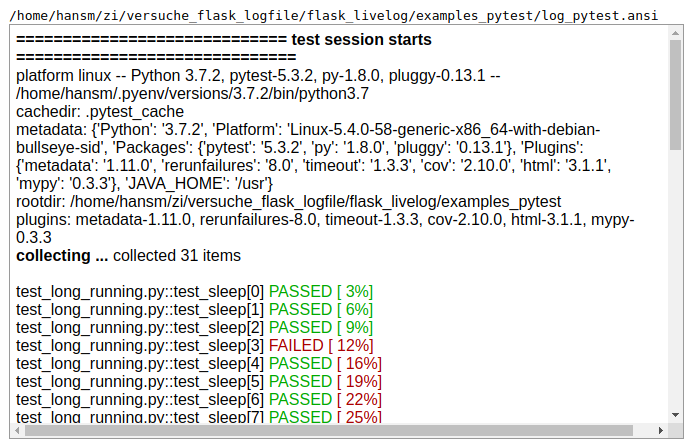
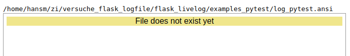
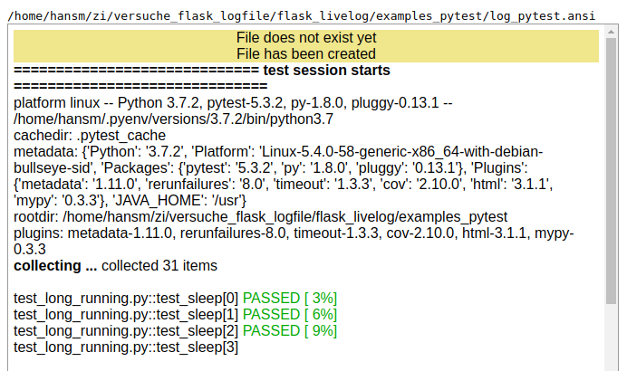

# Flask Logfile Live Logging

## Features
Display and live update of logfiles.

### Scroll windows
Scrolls automatically along the end of the file. When the scrollbar is moved more than 60pixels from the end, then automatic scrolling stops.

The scroll window detects when
 - A file is missing: Wait for a file to appear.
 - A file has been created: Logging starts.
 - A file dissapeared: The file will remains on the page.

Scroll update is done very efficiently in as big as possible chuncks. This may be a entire file or just a part of the line - for example when pytest draws a '.' for each successful test.

### File select form
This optional form allows to select from a given list of files.



### Renderer `Log`
Display a logfile and mark the lines which contain `ERROR`, `WARINING`, `INFO`.

### Renderer `Ansi2Html`
Takes a ansi file as input (`pytest --color=yes`).

### Renderer `LIVELOG_MOCK`
For testing: Slowly sends line by line to demonstrate updating and scrolling.

### Generator `generator_file`

This generator redirects a file. It detects when a file appears and dissapears.

### Generator `generator_pipe`

This generator starts a command, in the following example `dmesg` and redirects the output (Only tested on linux).




## Technical implementation

### Html
Based on [HTML5](https://developer.mozilla.org/en/docs/Web/HTML/HTML5) and [flexboxes](https://css-tricks.com/snippets/css/a-guide-to-flexbox/).

### Live update
Uses [Server-Sent Events](https://developer.mozilla.org/en-US/docs/Web/API/Server-sent_events/Using_server-sent_events) described in HTML5. This is very efficient one-way channel from flask to the scrollable html-container.

### File events
Detection of files to appear, dissapear and data written to the file is done very rudimentary polling using functionality found in `pathlib`.

There are libraries which monitor operating system events which would do the job much nicer: [Watchdog](https://pypi.org/project/watchdog/), [Blog](https://blog.magrathealabs.com/filesystem-events-monitoring-with-python-9f5329b651c3). To avoid additional dependencies I did not use them.

## Demo

Start Flask:
```bash
export FLASK_APP=app/webapp.py
export FLASK_ENV=development
flask run
```
Start Flask and open `http://localhost:5000/`:


You may observe how the page is filled and scrolled.
Please note the form to the top right.


This shows the logfile-renderer. Note that this example does not show the form in the top right.


This shows the ansi-color-renderer.


In this view you may
* Remove the file and reload the page:


* Run `./run_pytests.sh`:


## User Guide

### Integrate in your application

This repository shows how to integrate livelog:

* You need to copy `app/livelog.py` and `app/templates/livelog.html` to your flask directory.

* Add these lines to your `webapp.py`:
```python
provider = livelog.LogfileProvider(DIRECTORY_OF_THIS_FILE.parent, '**/*')
livelog.LiveLog(app, provider)
```

* Create a link to the livelog-page. You find examples in `app/templates/index.html`.


## Links for the technical stuff this library is based on

* [How to make a scrollable container with dynamic height using Flexbox](
    https://medium.com/@stephenbunch/how-to-make-a-scrollable-container-with-dynamic-height-using-flexbox-5914a26ae336)
* [You can also create a scrollable modal that allows scroll the modal body by adding](https://getbootstrap.com/docs/5.0/components/modal/)
* [Make a scrollable container with dynamic height using flexbox](https://medium.com/@stephenbunch/how-to-make-a-scrollable-container-with-dynamic-height-using-flexbox-5914a26ae336)


## Ansi2color

[AHA: C Implementation available on Linux](https://github.com/theZiz/aha)

[ANSI2HTML: Python Implementation used for this project](https://pypi.org/project/ansi2html/)

These are commands I was playing around using unbuffered output of pytest on linux.

```bash
stdbuf -oL pytest --html=report.html --self-contained-html --verbose --capture=no --color=yes | stdbuf -oL aha --no-header > log_pytest.html

stdbuf -oL pytest --html=report.html --self-contained-html --verbose --color=yes | stdbuf -oL aha --no-header > log_pytest.html

stdbuf -oL pytest --color=yes | stdbuf -oL aha --no-header > log_pytest.html

stdbuf -oL pytest --color=yes | stdbuf -oL ansi2html --partial --inline > log_pytest.html
```
